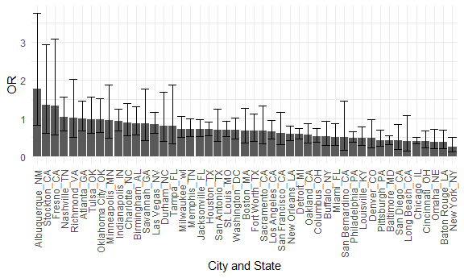

Homework 6
================
2022-12-02

``` r
library(tidyverse)
library(viridis)

knitr::opts_chunk$set(
    echo = TRUE,
    warning = FALSE,
  fig.width = 6,
  fig.asp = .6,
  out.width = "90%"
)
theme_set(theme_minimal() + theme(legend.position = "bottom"))
options(
  ggplot2.continuous.colour = "viridis",
  ggplot2.continuous.fill = "viridis"
)
scale_colour_discrete = scale_colour_viridis_d
scale_fill_discrete = scale_fill_viridis_d
```

# Problem 2

## Data import and Manipulation

``` r
p2 = read_csv(file = "./data/homicide-data.csv") %>% 
     janitor::clean_names() %>% 
  mutate(city_state = str_c(city, "_", state),
         solved = ifelse(disposition %in% "Closed by arrest", "Yes", "No"),
         victim_age = as.numeric(victim_age)
         ) %>% 
  filter(city_state != "Dallas_TX" &
         city_state != "Phoenix_AZ" &
          city_state != "Phoenix_AZ" &
           city_state != "Kansas City_MO" &
           city_state != "Tulsa_AL") %>% 
  filter(victim_race == "White" |
           victim_race == "Black") %>%
  drop_na(victim_age)
```

## Logistic On Baltimore and SAVE

``` r
logi_baltimore = p2 %>% 
  filter(city_state == "Baltimore_MD") %>% 
  mutate(
    resolved = as.numeric(solved == "Yes"),
    victim_race = fct_relevel(victim_race, "White")) %>% 
  select(resolved, victim_age, victim_race, victim_sex) %>% 
  glm(resolved ~ victim_age + victim_race + victim_sex, data = ., family = binomial()) 
save(logi_baltimore, file = "./logi_baltimore.RData")


 
logi_baltimore %>% 
  broom::tidy() %>% 
  mutate(OR = exp(estimate),
         conf.low = exp((estimate - 1.96 * std.error)),
         conf.high = exp((estimate + 1.96 * std.error))
         ) %>%
  filter(term == "victim_sexMale") %>% 
  select(term, OR, conf.low, conf.high) %>% 
  knitr::kable(digits = 3)
```

| term           |    OR | conf.low | conf.high |
|:---------------|------:|---------:|----------:|
| victim_sexMale | 0.426 |    0.325 |     0.558 |

## Function

``` r
logi = function(data){
  data %>% 
  glm(resolved ~ victim_age + victim_race + victim_sex, data = ., family = binomial()) %>% 
  broom::tidy() %>% 
  mutate(OR = exp(estimate),
         conf.low = exp((estimate - 1.96 * std.error)),
         conf.high = exp((estimate + 1.96 * std.error))
         ) %>%
  filter(term == "victim_sexMale") %>% 
  select(term, OR, conf.low, conf.high) 
}
```

## Create GLM on all cities dataframe

``` r
all_cities_df = p2 %>% 
  relocate(city_state) %>% 
  mutate(
    resolved = as.numeric(solved == "Yes"),
    victim_race = fct_relevel(victim_race, "White")) %>% 
  select(city_state, resolved, victim_age, victim_race, victim_sex) %>% 
  nest(data = resolved : victim_sex) %>% 
  mutate(
    model = map(.x = data, ~logi(.x))
  ) %>% 
  unnest(cols = model) %>% 
  select(-data, -term)
```

## Plot and comments

``` r
all_cities_df %>%
  arrange(desc(OR)) %>% 
  ggplot(aes(x = fct_inorder(city_state), y = OR)) + 
  geom_bar(stat = 'identity') + geom_errorbar(aes(ymin = conf.low, ymax = conf.high)) + 
  theme(axis.text.x = element_text(angle = 90, vjust = 0.5, hjust = 1)) +
  labs(
    x = "City and State",
    y = "OR"
  ) 
```



Only a few cities have adjusted odds ratio for solving homicides
comparing male victims to female victims above 1. In addition, the
confidence interval for most of the cities are relatively large making
the results insignificant. Albuquerque NM has the highest OR and New
York NY has the lowest OR.
